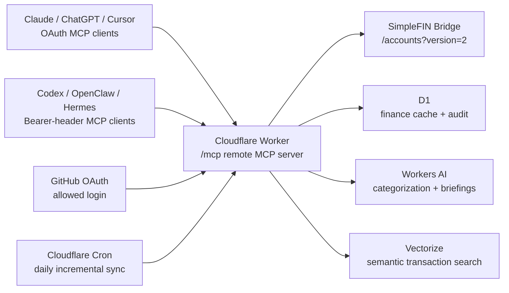

# SimpleFIN Cloudflare Finance MCP

[](https://www.typescriptlang.org/)
[](https://developers.cloudflare.com/workers/)
[](https://modelcontextprotocol.io/)
[](LICENSE)

A deploy-your-own remote MCP server for SimpleFIN finance data.

Most personal finance MCPs either depend on Plaid-style paid aggregation or wrap
heavier budgeting stacks such as Firefly III or Actual Budget. This starter is
SimpleFIN-first: direct bank sync through SimpleFIN Bridge, Cloudflare-native
storage and scheduling, agent-first response shapes, and honest AI health
counters so callers know when categorization came from Workers AI versus a
deterministic fallback.

This repository is a public starter. It contains no tokens, no financial data,
no Cloudflare resource IDs, and no personal deployment history.

## What You Get

- Remote MCP endpoint at `/mcp`
- OAuth for Claude, ChatGPT, Cursor, and other OAuth-native MCP clients
- Bearer tokens for clients that support custom headers
- Scheduled SimpleFIN sync with a 3-day incremental overlap
- Automatic account-specific 90-day backfill for new/problem accounts
- D1 cache with normalized accounts, transactions, sync runs, coverage, and audit events
- Workers AI transaction categorization and weekly briefings
- Honest AI health counters: real AI enrichments, deterministic fallbacks, parse failures, quota fallbacks, and low-confidence rows
- Deterministic category guardrails for obvious payments, fees, subscriptions, dining, and one-off purchases
- Canonical merchant keys for grouping/search, with processor-code cleanup and common synonym mapping
- Merchant-level summaries and recurring obligation detection beyond basic subscriptions
- Vectorize semantic transaction search using `@cf/baai/bge-m3` embeddings and a 1024-dimensional cosine index
- Raw SimpleFIN diagnostics scoped to one account at a time
- Sanitized D1 audit timing for MCP/HTTP operations without storing prompts, tool args, finance payloads, or tokens

## Sample Output

The main dashboard tool is designed to be safe for first-call agent context:

```json
{
  "accounts": {
    "count": 3,
    "total_balance": 4380.42
  },
  "cashflow": {
    "period_days": 30,
    "income": 3200,
    "spending": 1842.67,
    "net": 1357.33
  },
  "top_merchants": [
    { "merchant": "Demo Grocery", "amount": 245.18, "category": "groceries" },
    { "merchant": "Demo Visa Payment", "amount": 220, "category": "transfers" }
  ],
  "ai_enrichment": {
    "transactions": 128,
    "ai_enriched": 126,
    "fallback_enriched": 2,
    "parse_fallback": 0,
    "quota_fallback": 0,
    "low_confidence_enriched": 9,
    "low_confidence_threshold": 0.75,
    "confidence_distribution": {
      "0.0-0.5": 0,
      "0.5-0.7": 2,
      "0.7-0.9": 117,
      "0.9-1.0": 9
    },
    "healthy": true
  },
  "data_quality": {
    "fresh": true,
    "health_issues": []
  }
}
```

More sanitized examples live in [docs/examples](docs/examples):

- [finance_overview.json](docs/examples/finance_overview.json)
- [worker_operational_status.json](docs/examples/worker_operational_status.json)
- [detect_subscriptions.json](docs/examples/detect_subscriptions.json)
- [detect_recurring_obligations.json](docs/examples/detect_recurring_obligations.json)
- [merchant_summary.json](docs/examples/merchant_summary.json)
- [find_unusual_transactions.json](docs/examples/find_unusual_transactions.json)
- [generate_weekly_money_briefing.json](docs/examples/generate_weekly_money_briefing.json)

## Why This Shape

| Alternative | Cost | Setup | Data ownership | Where they win |
|---|---:|---|---|---|
| Plaid-based MCPs | Often paid at multi-account volume | Plaid Link frontend required | Third-party aggregator | Categorization quality, institution coverage |
| Firefly III MCPs | Free software, self-hosting cost | Run Firefly III plus a database stack | Self-hosted | Budget envelopes, rules engine |
| Actual Budget MCPs | Free software, self-hosting cost | Local files or self-hosted app | Self-hosted | Envelope budgeting workflow |
| SimpleFIN-to-X bridges | Free software, self-hosting cost | Cron daemon plus downstream tool | Self-hosted | Great sync pipelines, but not MCP-native |

This project optimizes for a small but useful niche: low-cost, owner-controlled,
SimpleFIN-backed finance data exposed through a remote MCP interface built for
agents to inspect before they trust.

## Architecture



## Agent Guidance Pattern

The `agent_guidance` tool is intentionally the first call. It tells an agent how
to use the MCP without loading raw transaction history:

```json
{
  "recommended_first_calls": [
    "auth_context",
    "worker_operational_status",
    "simplefin_data_coverage",
    "finance_overview"
  ],
  "trust_gates": [
    "Do not answer financial questions when /ready is unhealthy.",
    "Check account coverage before per-account conclusions.",
    "Check ai_enrichment before trusting AI-derived categories or briefings."
  ],
  "context_budgeting": [
    "Start with finance_overview.",
    "Use search_transactions or semantic_transaction_search for narrow questions.",
    "Use simplefin_raw_account only with one accountId and a narrow limit."
  ]
}
```

The reusable design ideas behind this are described in
[docs/PATTERNS.md](docs/PATTERNS.md).

## MCP Tools

Read tools:

- `agent_guidance`
- `auth_context`
- `connection_status`
- `worker_operational_status`
- `list_accounts`
- `finance_overview`
- `simplefin_data_coverage`
- `simplefin_account_gaps`
- `simplefin_raw_account`
- `simplefin_sync_history`
- `get_transactions`
- `search_transactions`
- `semantic_transaction_search`
- `summarize_cashflow`
- `detect_subscriptions`
- `detect_recurring_obligations`
- `merchant_summary`
- `list_corrections`
- `get_eval_history`
- `find_unusual_transactions`
- `generate_weekly_money_briefing`

Admin tools:

- `sync_simplefin`
- `claim_setup_token`
- `categorize_uncategorized_transactions`
- `correct_transaction`
- `undo_correction`
- `label_eval_transaction`
- `run_eval`
- `refresh_insights`

Use `ADMIN_TOKEN` or the configured OAuth admin identity only for setup, sync,
refresh, correction, and eval operations.

## Quick Start

```bash
npm install
npm run worker:typecheck
npm run build
```

Then follow [docs/SETUP.md](docs/SETUP.md) to create Cloudflare resources, set
secrets, configure OAuth, apply migrations, and deploy.

Useful client examples:

- [configs/remote-mcp.example.json](configs/remote-mcp.example.json)
- [configs/cloudflare-worker-mcp.example.json](configs/cloudflare-worker-mcp.example.json)
- [examples/claude-desktop-config.example.json](examples/claude-desktop-config.example.json)
- [examples/cursor-mcp.example.json](examples/cursor-mcp.example.json)
- [examples/oauth-custom-connector.example.md](examples/oauth-custom-connector.example.md)

## Public Repo Safety

This repo is intentionally generic:

- placeholder Cloudflare IDs
- placeholder domain
- placeholder GitHub login
- no D1 export
- no `.env`
- no local bearer config
- no deployment-specific history

Before publishing your own fork, run:

```bash
rg -n "SIMPLEFIN_ACCESS_URL|ADMIN_TOKEN|MCP_BEARER_TOKEN|client_secret|finance\\.example\\.com|your-github-login"
git status --short
```

Seeing placeholder names in docs/config is fine. Seeing real token values is not.

If you keep a private fork for your own deployment, put real domains, Cloudflare
resource IDs, operational history, and agent handoff details there. Keep this
public starter free of personal endpoint names, real account IDs, D1 exports,
sync outputs, bearer tokens, OAuth secrets, or financial examples from a live
account.

## Project Docs

- [Setup](docs/SETUP.md)
- [Finance Agent Workflow](docs/FINANCE_AGENT_WORKFLOW.md)
- [Reusable MCP Patterns](docs/PATTERNS.md)
- [Contributing](CONTRIBUTING.md)
- [Security](SECURITY.md)
- [License](LICENSE)
